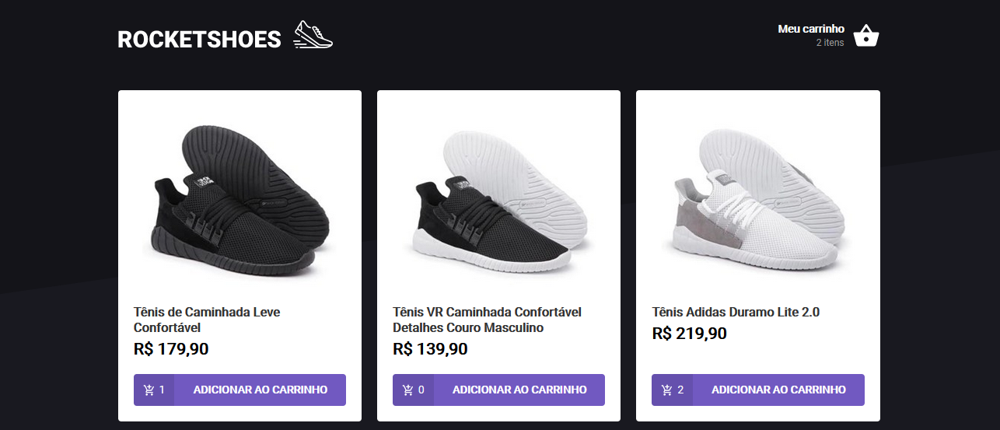

  

Esse é desafio feito durante minha jornada no [Ignite](https://www.rocketseat.com.br/ignite), da Rocketseat.

# Desafio: criando um hook de carrinho de compras

Nesse desafio, você deverá criar uma aplicação para treinar o que aprendeu até agora no ReactJS

Essa será uma aplicação onde o seu principal objetivo é criar um hook de carrinho de compras. Você terá acesso a duas páginas, um componente e um hook para implementar as funcionalidades pedidas nesse desafio:

- Adicionar um novo produto ao carrinho;
- Remover um produto do carrinho;
- Alterar a quantidade de um produto no carrinho;
- Cálculo dos preços sub-total e total do carrinho;
- Validação de estoque;
- Exibição de mensagens de erro;
- Entre outros.

## Se preparando para o desafio

Para esse desafio, além dos conceitos vistos em aula utilizaremos algumas coisa novas para deixar a nossa aplicação ainda melhor:

- Fake API com JSON Server;
- Preservar dados do carrinho com localStorage API;
- Mostrar erros com toastify.

## O que devo editar na aplicação?

Com o template já clonado, as depêndencias instaladas e a fake API rodando, você deve completar onde não possui código com o código para atingir os objetivos de cada teste. Os documentos que devem ser editados são:

- src/components/Header/index.tsx;
- src/pages/Home/index.tsx;
- src/pages/Cart/index.tsx;
- src/hooks/useCart.tsx.

## Como executar

- Clone o repositório
- Instale as dependências com `yarn`
- Inicie a fake api com `yarn server`
- Inicie o servidor com `yarn start`

## Licença

Esse projeto está sob a licença MIT. Veja o arquivo [LICENSE](LICENSE.md) para mais detalhes.
